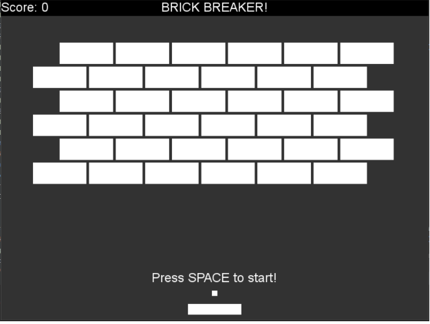

# CSE3130-Project
Developer: Sean Jin
Project: Brick Breaker

## 🧱🔨 Description
The game "Brick Breaker" is a one-player game, where all bricks on the screen must be broken, through bouncing the ball using the paddle. The goal of the game is to beat all levels, and eventually finish the game. If the ball falls from the bottom of the screen, 1 out of 5 total lives is lost.

## 🗺️🤔💭 Planning Components
Before the project was coded, some inspiration where taken from the follow images:
