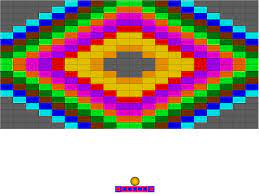

# CSE3130-Project
Developer: Sean Jin
Project: Brick Breaker

## 🧱🔨 Description
The game "Brick Breaker" is a one-player game, where all bricks on the screen must be broken, through bouncing the ball using the paddle. The goal of the game is to beat all levels, and eventually finish the game. If the ball falls from the bottom of the screen, 1 out of 5 total lives is lost.

## 🗺️🤔💭 Planning Components
Before the project was coded, some inspiration where taken from the follow images:

## 🎂🎊🎊 Special Features
This project includes 3 special features:
1. The paddle is able to slice the ball, making it go faster or slower according to the direction the ball is heading v.s. the direction the paddle is heading. If they are opposite directions, the ball will slow down, if they are heading in the same direction the ball will speed up!
2. The game has a life system in place, where the player has a limited amount of lives. If the player loses more than the given number of lives, they lose and must restart from the first level.
3. There is an extra level in this game!

## How to Run the Program
The program can be run in any python IDE. The source code can be copied and pasted into any IDE and it will run. The game requires pygame to be installed before running the game. 

## 🪞🤔💭 Reflection
Overall, I faced many theoretical challenges, which include trying to understand the collision mechanisms, and getting it to work consistently and reliably. I had to figure out how to calculate which side the ball and bricks were colliding on, and this gave me a lot of stress, anger, and confusion. This taught me patience and allowed me to eventually sit down and think about my code slowly and properly. Furthermore, the organization and chronological order in which the game was built had a lot of issues initially. Oftentimes, the sequence of events did not match up to how I envisioned it to be, which was also an area of concern and frustration for me.